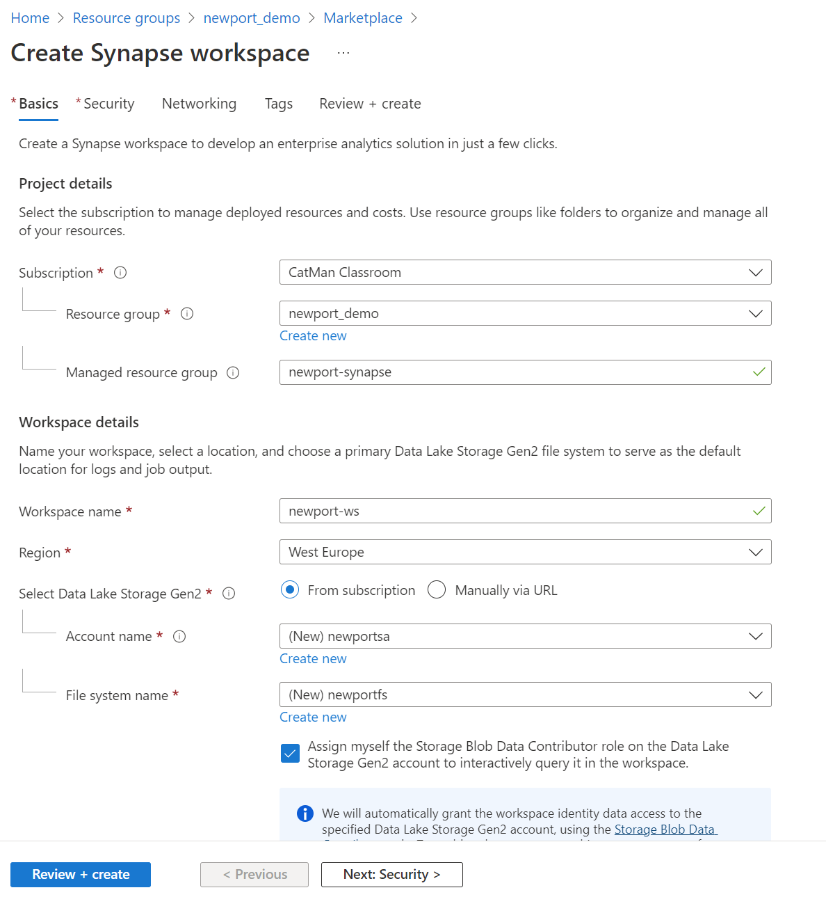

# Create Synapse Analytics Workspace

**Basic**

Select: *<resource group created in step 01>*

Managed resource group: optional (for aux resources)

Workspace Name: newport-ws   
region: *<same as step 01>*

Select Data Lake Storage Gen2: From Subscription

Account: *(new) newportdemosa*

File System Name: *(new) data*

Check *"Assign myself the Storage Blob Data Contributor role on the Data Lake Storage Gen2 account to interactively query it in the workspace."*

**Screenshot**

**Security**

Select: "Use both local and Azure Active Directory (Azure AD) authentication"

SQL Server Admin login: *sqladminuser
SQL Password: *select fitting password

All other options: leave as is

**Networking**

Check: "Allow connections from all IP addresses"

All other options: leave as is

**Tags**

Tags: Owner, State, Purpose

## Upload Data

Open Azure Storage Explorer (or upload via Azure Portal, not preferred)

Login with proper account

Navigate to the Storage Account created above

Select the container: Data (as created above)

Create new folder: (new) raw

Upload file: Chicago_Crimes_sample3k.csv
