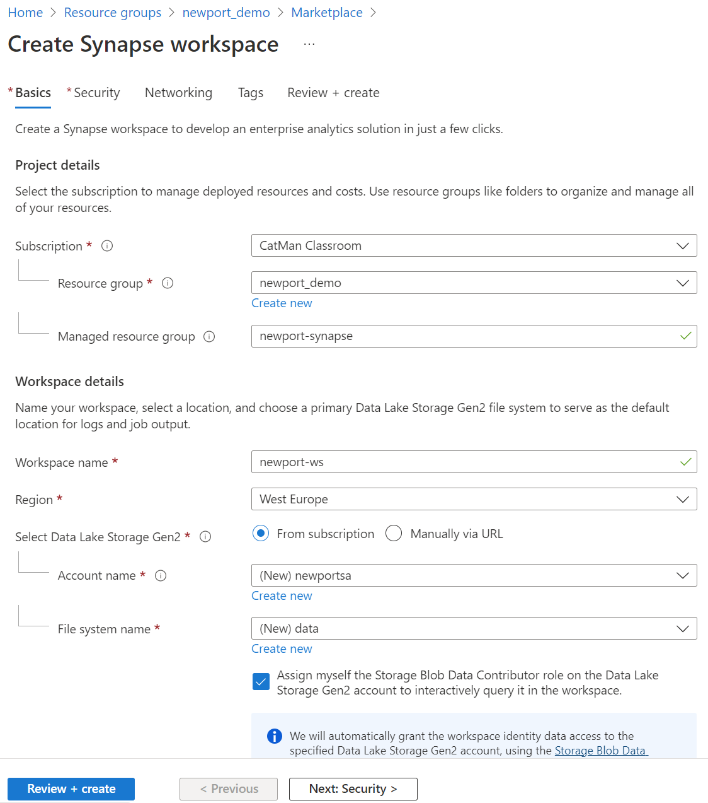

# Create Synapse Analytics Workspace

In Resource Group created earlier.

Click: *Create* (the '+' icon)

Type: *synapse* (in the search bar)

Select: *Azure Synapse Analytics* (suggested)

Click: *Create/Azure Synapse Analytics*

# Wizard

## Basic

Select: *<resource group created in step 01>*

Managed resource group: optional (for aux resources)

Workspace Name: newport-ws   
region: *<same as resource group>*

Select Data Lake Storage Gen2: From Subscription

Account: *(new) newportsa* (has to be gloablly unique, so pick something else)

File System Name: *(new) data*

Check *"Assign myself the Storage Blob Data Contributor role on the Data Lake Storage Gen2 account to interactively query it in the workspace."*

**Screenshot**

**Security**

Select: "Use both local and Azure Active Directory (Azure AD) authentication"

SQL Server Admin login: *sqladminuser
SQL Password: *select fitting password

All other options: leave as is

**Networking**

Check: "Allow connections from all IP addresses"

All other options: leave as is

**Tags**

Tags: Owner, State, Purpose
  
Click: *Create* (this will take about 5 minutes, more depending on the load at the time of deployment - use this time to ask questions)

## Upload Data

Open Azure Storage Explorer (or upload via Azure Portal, not preferred)

Login with proper account

Navigate to the Storage Account created above

Select the container: Data (as created above)

Create new folder: (new) raw

Upload file: Chicago_Crimes_sample3k.csv
  
## Link to education material (to avoid everyone in the room uploading ½ Gb data)
  
Go to resource group
  
Select: <the Synapse Workspace> just created
  
Click: *Open Synapse Studio*/*Open*
  
Click: *Manage*
  
Click: *Linked services*
  
Click: *New*
 
Select: *Azure Blob Storage*
  
Name: Enter describing name aka PublicSource, ChicagoSource etc.

Account selection method: *Enter manually*
  
Storage account name: publictrainingresources
  
Storage account key: *qvoMRGwszSNBGzhJf1/ryNY5tsvv3r9vFkZ0GlFGW1qaz+Hr6LL+/ba396kTkywstFviKIeWrwMZ+AStiXBlKQ==*

Click: *Test connection*
  
Click: *Create*
  
The *Public Dataset* is now available for you to reference in your pipelines etc.  

